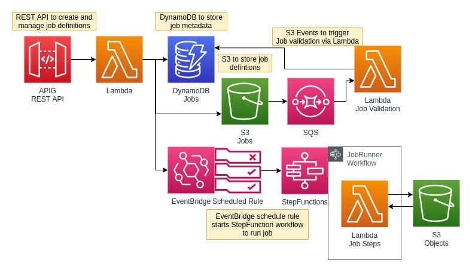

A service to manage file job definitions and schedules with a REST API.

This system provides functionality to create and manage scheduled S3 file job definitions through a REST API. It uses API Gateway and Lambda for the REST API backend logic and StepFunctions for orchestrating the Lambdas to run the S4 file job definitions. 
It stores job metadata in DyanmoDB and job definitions in S3.




1. POST a job definition to the endpoint to create a new job
```json
{
  "name": "test-copy-job",
  "schedule": "cron(0 12 * * ? *)",
  "state": "ENABLED",
  "steps": [
  {
    "id": 0,
    "name": "step1",
    "action": "COPY",
    "source": "bucket1/file1",
    "destination": "bucket2/file1"
  }
  ]
}
```
Available `actions`s are `COPY`, `MOVE`, `DELETE`, and `MERGE`. 

For example, the job definition below merges 2 files together, copies the result into two different locations, and deletes the source files. The job runs once a day at 1am.

```json
{
  "name": "merge-copy-delete",
  "schedule": "cron(0 1 * * ? *)",
  "state": "ENABLED",
  "steps": [
    {
      "id": 0,
      "name": "step1",
      "action": "MERGE",
      "sources": [
        "bucket1/file1.txt",
        "bucket1/file2.txt"
      ],
      "destination": "bucket1/merged_files.txt"
    },
    {
      "id": 1,
      "name": "step2",
      "action": "COPY",
      "source": "bucket1/merged_files.txt",
      "destination": "bucket2/merged_files.txt"
    },
    {
      "id": 2,
      "name": "step3",
      "action": "MOVE",
      "source": "bucket1/merged_files.txt",
      "destination": "bucket3/merged_files.txt"
    },
    {
      "id": 3,
      "name": "step4",
      "action": "DELETE",
      "source": "bucket1/file1.txt"
    },
    {
      "id": 4,
      "name": "step5",
      "action": "DELETE",
      "source": "bucket1/file2.txt"
    }
  ]
}
```

2. GET /job/{id}, PUT /job/{id}, and DELETE /job/{id} to manage the job through the API.

3. An EventBridge scheduled rule is activated based on the provided job schedule and state. This invokes a StepFunction Workflow to execute the job steps.


4. The StepFunction Workflow generates this JSON from details stored in DynamoDB and the JSON stored in S3.
```json
{
"id": "4lw5kjh435lkj",
"name": "test-copy-job",
"stepCount": 1,
"start": 0,
"current": 0,
"steps": [
  {
    "id": 0,
    "name": "step1",
    "action": "COPY",
    "source": "bucket1/file1",
    "destination": "bucket2/file1"
  }
]
}
```

2. StepFunctions iterates through the steps defined in the job definition.


### TODO
- [x] generate EventBridge during job creation
- [x] implement PUT update endpoint
- [x] Implement asynchronous job definition validation (block jobs from running if the definition is malformed)
- [ ] complete full pagination implementation
- [x] secure API with api keys and usage plan throttling
- [ ] typed errors