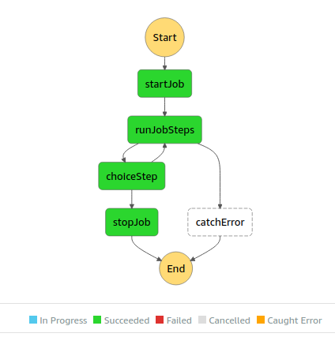

A service to manage file job definitions and schedules with a REST API.

1. POST a job definition to the endpoint to create a new job
```json
{
  "name": "test-copy-job",
  "schedule": "cron(0 12 * * ? *)",
  "state": "ENABLED",
  "steps": [
  {
    "id": 0,
    "name": "step1",
    "action": "COPY",
    "source": "bucket1/file1",
    "destination": "bucket2/file1"
  }
  ]
}
```

2. GET /job/{id}, PUT /job/{id}, and DELETE /job/{id} to manage the job through the API.

3. An EventBridge scheduled rule is activated based on the provided job schedule and state. This invokes a StepFunction Workflow to execute the job steps.


4. The StepFunction Workflow generates this JSON from details stored in DynamoDB and the JSON stored in S3.
```json
{
"id": "4lw5kjh435lkj",
"name": "test-copy-job",
"stepCount": 1,
"start": 0,
"current": 0,
"steps": [
  {
    "id": 0,
    "name": "step1",
    "action": "COPY",
    "source": "bucket1/file1",
    "destination": "bucket2/file1"
  }
]
}
```

2. StepFunctions iterates through the steps defined in the job definition.



### TODO
- [ ] generate EventBridge during job creation
- [ ] implement PUT update endpoint
- [ ] complete full pagination implementation
- [ ] secure API with JWT and custom authorizer
- [ ] typed errors